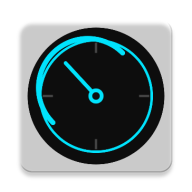
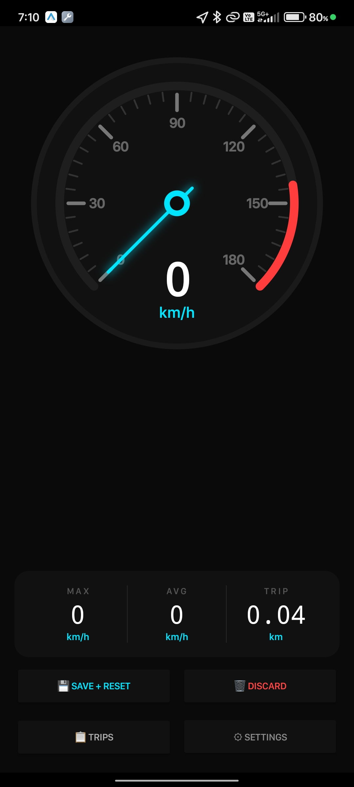
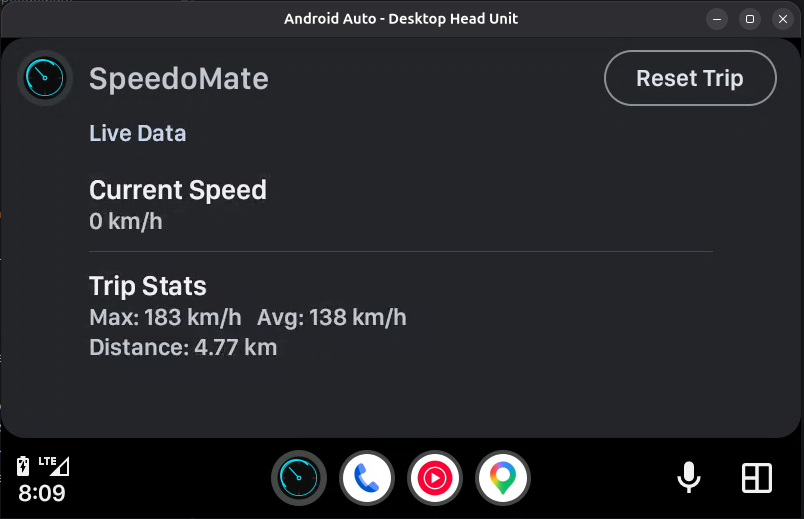

<div align="center">



# 🚗 SpeedoMate

### *Your smart GPS speedometer — on your phone and in your car.*

[](https://android.com)
[](https://kotlinlang.org)
[](https://www.android.com/auto/)
[](https://developer.android.com)
[](LICENSE)

<br/>

> A beautiful, real-time GPS speedometer for Android with an analog + digital display,  
> full trip tracking, persistent data, and native **Android Auto** support.

<br/>

---

## 📸 Screenshots

| 📱 Phone | 🚗 Android Auto |
|:---:|:---:|
|  |  |
| *Analog + digital speedometer* | *Live data on your car screen* |

---

</div>

## ✨ Features

- 🎯 **Real-time GPS Speed** — Accurate speed using `FusedLocationProviderClient`, same API as Google Maps
- ⚡ **Analog + Digital Speedometer** — Beautiful glowing needle gauge with smooth animations
- 🏎️ **Smooth Animations** — Startup sweep, needle overshoot, rolling digits, glow pulse & danger zone flicker
- 📊 **Trip Statistics** — Max speed, average speed, and trip distance tracked automatically
- 💾 **Persistent Data** — Trip data saved with DataStore, survives app close and phone restart
- 🔄 **km/h ↔ mph Toggle** — Switch units instantly from Settings
- 🚗 **Android Auto** — Native Car App integration, view live speed & stats on your car's display
- 🔄 **Reset Trip** — One tap to reset all trip data from phone or car screen
- 🌙 **Dark Theme** — Sleek dark UI optimized for driving visibility

---

## 🎬 How It Works

```
GPS Satellite
     │
     ▼
FusedLocationProvider (500ms updates)
     │
     ▼
SpeedTrackingService (Background Foreground Service)
     │
     ├──► StateFlow (speed, max, avg, distance)
     │         │
     │    ┌────┴────┐
     │    ▼         ▼
     │  Phone UI  Android Auto
     │  (Canvas)  (ListTemplate)
     │
     └──► DataStore (persistent storage)
```

---

## 🛠️ Tech Stack

| Layer | Technology |
|---|---|
| Language | Kotlin |
| Architecture | MVVM + StateFlow |
| Location | Google FusedLocationProviderClient |
| Car Integration | AndroidX Car App Library |
| Persistence | Jetpack DataStore |
| Background | Foreground Service |
| UI | Custom Canvas View + ConstraintLayout |
| Animations | ValueAnimator + ObjectAnimator |

---

## 🚀 Getting Started

### Prerequisites
- Android Studio Hedgehog or newer
- Android device running **API 26+** (Android 8.0 Oreo)
- For Android Auto: Android Auto app installed on device

### Installation

```bash
# Clone the repository
git clone https://github.com/Hrishi2861/SpeedoMate.git

# Open in Android Studio
# Let Gradle sync
# Run on device or emulator
```

### Build

```bash
./gradlew assembleDebug
```

APK will be at `app/build/outputs/apk/debug/app-debug.apk`

---

## 🚗 Android Auto Setup

1. Install **Android Auto** on your phone
2. Enable **Developer Mode** in Android Auto settings (tap version 10 times)
3. Enable **Unknown sources** in Android Auto Developer settings
4. Connect phone to car or use **Desktop Head Unit (DHU)** for testing:

```bash
# Run DHU emulator
~/Android/Sdk/extras/google/auto/desktop-head-unit
```

---

## 📁 Project Structure

```
com.speedomate/
├── data/
│   ├── PrefsManager.kt          # DataStore for settings & trip persistence
│   └── TripData.kt              # Trip data model
├── service/
│   ├── SpeedTrackingService.kt  # Background GPS + speed tracking
│   └── SpeedAutoService.kt      # Android Auto CarAppService
└── ui/
    ├── MainActivity.kt          # Main phone UI
    ├── SettingsActivity.kt      # km/h ↔ mph toggle
    ├── SpeedViewModel.kt        # MVVM ViewModel
    └── SpeedometerView.kt       # Custom analog gauge canvas view
```

---

## 🔒 Permissions

| Permission | Reason |
|---|---|
| `ACCESS_FINE_LOCATION` | GPS speed tracking |
| `ACCESS_COARSE_LOCATION` | Fallback location |
| `FOREGROUND_SERVICE` | Background speed tracking |
| `FOREGROUND_SERVICE_LOCATION` | Location while in background |
| `POST_NOTIFICATIONS` | Foreground service notification |

> ✅ No internet permission required — everything works offline!

---

## 🤝 Contributing

Contributions are welcome! Feel free to:

---

## 📄 License

```
MIT License — feel free to use, modify and distribute.
See LICENSE file for details.
```

---

<div align="center">

Made with ❤️ by **Hrishi**

*If SpeedoMate saved you from a speeding ticket, give it a ⭐*

[](https://github.com/Hrishi2861/SpeedoMate)

</div>
